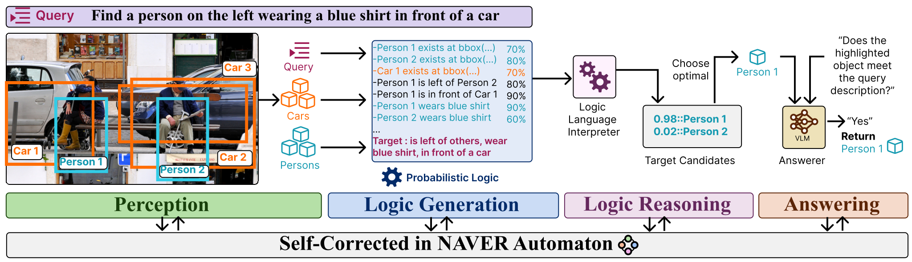

#  NAVER: A Neuro-Symbolic Compositional Automaton for Visual Grounding with Explicit Logic Reasoning

<div align="center">
    
    <p></p>
</div>

<div align="center">
    <a href="https://github.com/ControlNet/NAVER/issues">
        
    </a>
    <a href="https://github.com/ControlNet/NAVER/network/members">
        
    </a>
    <a href="https://github.com/ControlNet/NAVER/stargazers">
        
    </a>
    <a href="https://arxiv.org/abs/2502.00372">
        
    </a>
</div>

**This repo is the official implementation for the paper [NAVER: A Neuro-Symbolic Compositional Automaton for Visual Grounding with Explicit Logic Reasoning](https://arxiv.org/abs/2502.00372).**

The code will be available soon.

## Abstract

Visual Grounding (VG) tasks, such as referring expression detection and segmentation tasks are important for linking visual entities to context, especially in complex reasoning tasks that require detailed query interpretation. This paper explores VG beyond basic perception, highlighting challenges for methods that require reasoning like human cognition. Recent advances in large language methods (LLMs) and Vision-Language methods (VLMs) have improved abilities for visual comprehension, contextual understanding, and reasoning. These methods are mainly split into end-to-end and compositional methods, with the latter offering more flexibility. Compositional approaches that integrate LLMs and foundation models show promising performance but still struggle with complex reasoning with language-based logical representations. To address these limitations, we propose NAVER, a compositional visual grounding method that integrates explicit probabilistic logic reasoning within a finite-state automaton, equipped with a self-correcting mechanism. This design improves robustness and interpretability in inference through explicit logic reasoning. Our results show that NAVER achieves SoTA performance comparing to recent end-to-end and compositional baselines.

## References
If you find this work useful for your research, please consider citing it.
```bibtex
@article{cai2025naver,
  title = {NAVER: A Neuro-Symbolic Compositional Automaton for Visual Grounding with Explicit Logic Reasoning},
  author = {Cai, Zhixi and Ke, Fucai and Jahangard, Simindokht and Garcia de la Banda, Maria and Haffari, Reza and Stuckey, Peter J. and Rezatofighi, Hamid},
  journal = {arXiv preprint arXiv:2502.00372},
  year = {2025},
}
```
